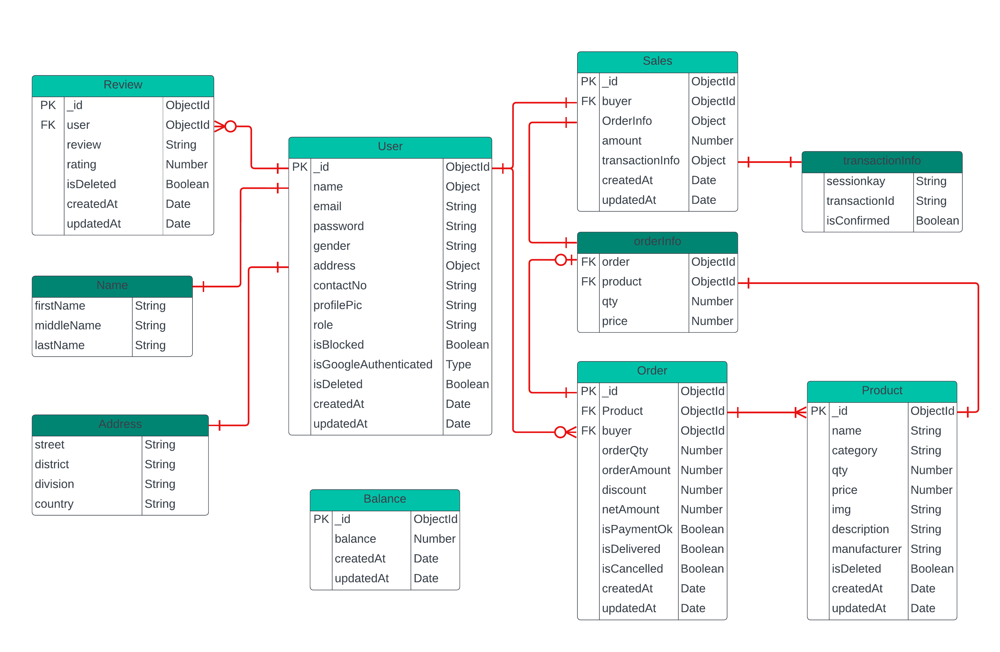

# Inventory Management Server

## Live Server

[Click Here to Visit the Live Server](https://inventory-management-server-indol.vercel.app/)

## Getting Started

### Prerequisites

Make sure you have the following installed on your system:

- Node.js
- Git

### Installation

1. Clone the repository:
   ```sh
    git clone https://github.com/engrkashem/inventory-management-server.git
    cd inventory-management-server
   ```
2. Install dependencies:
   ```sh
    npm install
   ```
3. Create a .env file in the root directory and add your environment variables as per .env.example file

4. Start the server:
   ```sh
    npm run dev
   ```

## API Endpoints

[Click Here to Visit full API documentation](https://inventory-management-server-indol.vercel.app/)

## Example Requests

Get Your Order cart Items

```sh
  curl -X GET https://agile-badlands-34653.herokuapp.com/api/v2/orders/my-cart -H "Authorization: Bearer your_token"
```

Add a Product to your Cart

```sh
  curl -X POST https://agile-badlands-34653.herokuapp.com/api/v2/orders -H "Authorization: Bearer your_token" -d '{"orderQty": 10}'
```

## Project Details

### Technologies/Frameworks Used

- **Node.Js**: Server environment.
- **TypeScript**: Scripting language.
- **Express**: Framework to connect Node.js with MongoDB.
- **Mongoose**: Framework for data sanity to with MongoDB.
- **SSLCommerz**: Payment method.
- **ZOD**: To Validate request.
- **jsonwebtoken**: To ensure data security.
- **Vercel**: For live server deployment.

### Project Structure

- image need to upload

### ERD (Entity Relationship Diagram)



## Contributing

Contributions are welcome! Please follow these steps:

1. Fork the repository.

2. Create a new branch:

```sh
  git checkout -b feature-branch
```

3. Make your changes.
4. Commit your changes:

```sh
  git commit -m 'Add some feature'
```

5. Push to the branch:

```sh
  git push origin feature-branch
```

6. Open a pull request.

## Contact

For any questions or feedback, please reach out to kashem3091@gmail.com.
