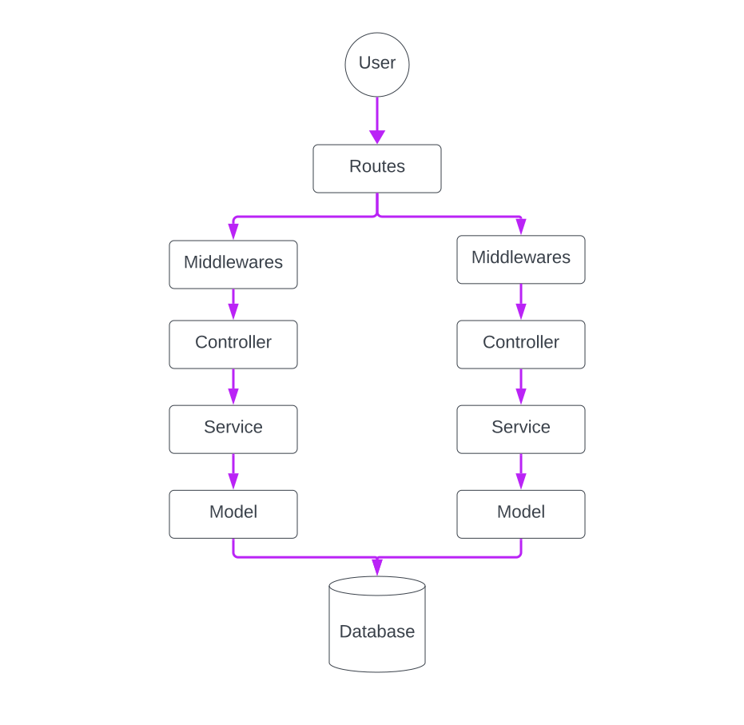
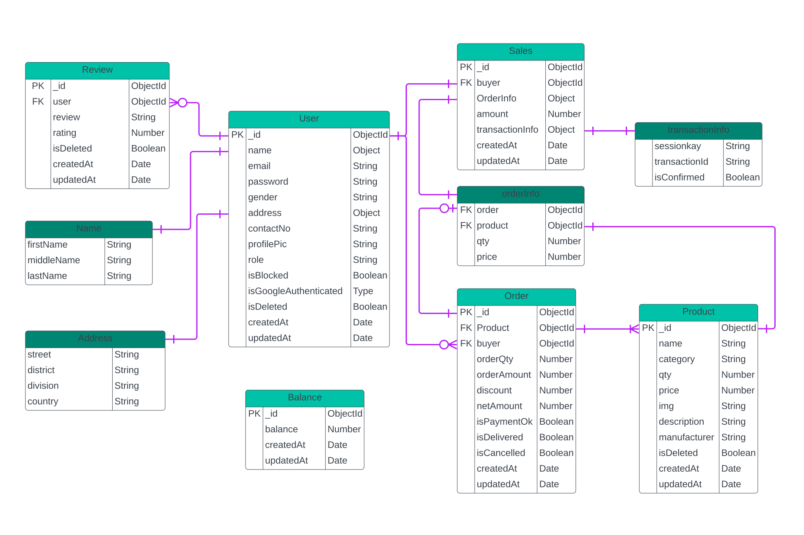

# Inventory Management Server

## Live Server

[Click Here to Visit the Live Server](https://inventory-management-server-indol.vercel.app/)

## Getting Started

### Prerequisites

Make sure you have the following installed on your system:

- Node.js
- Git

### Installation

1. Clone the repository:
   ```sh
    git clone https://github.com/engrkashem/inventory-management-server.git
    cd inventory-management-server
   ```
2. Install dependencies:
   ```sh
    npm install
   ```
3. Create a .env file in the root directory and add your environment variables as per .env.example file

4. Start the server:
   ```sh
    npm run dev
   ```

## API Endpoints

[Click Here to Visit full API documentation](https://inventory-management-server-indol.vercel.app/)

## Example Requests

Get Your Order cart Items

```sh
  curl -X GET https://agile-badlands-34653.herokuapp.com/api/v2/orders/my-cart -H "Authorization: Bearer your_token"
```

Add a Product to your Cart

```sh
  curl -X POST https://agile-badlands-34653.herokuapp.com/api/v2/orders -H "Authorization: Bearer your_token" -d '{"orderQty": 10}'
```

## Project Details

### Technologies/Frameworks Used

- **Node.js**: Runtime environment.

- **TypeScript**: Ensures type safety and improved code quality throughout the project.

- **Express**: Utilizes Express.js to build a robust and scalable RESTful API.

- **Mongoose**: Object Data Modeling (ODM) library for MongoDB and Node.js, ensuring data sanity.

- **MongoDB**: Database used to store and manage data efficiently, supporting high scalability and flexibility.

- **SSLCommerz**: Payment gateway integration for secure transactions.

- **ZOD**: Schema declaration and validation library ensuring data integrity and correctness.

- **jsonwebtoken**: Library to ensure data security through JWT (JSON Web Tokens).

- **Vercel**: Platform for deploying and hosting your live server.

- **Jest**: Testing framework used for unit and integration testing to ensure the reliability of the API.

### Project Data Flow Diagram



### ERD (Entity Relationship Diagram)



### Key Features

- **Modular Architecture**: Follows a modular architecture with clear separation of concerns:

  - **Routes**: Define the endpoints and their corresponding handlers.
  - **Controllers**: Handle the business logic for each route.
  - **Services**: Contain the core logic and interactions with the database.
  - **Models**: Define the data schema and interact with MongoDB.

- **Admin Dashboard**: Offers admin functionalities to manage users, products, and orders efficiently.

- **Order Tracking**: Allows users to track the status of their orders from placement to delivery.

- **Order Management**: It includes Cart management, order confirmation and order fulfillment.

- **Payment**: Integrated with SSLCommerz payment gateway to handle secure and reliable online transactions.

- **Product Reviews**: Users can provide reviews for products they have purchased, enabling feedback and rating within the system.

- **Authentication**: Self designed and Google authentication Integrated.

- **User Registration and Management**: Provides endpoints for user registration, profile updates, and account management.

- **Role-Based Access Control**: The application supports multiple user roles including SuperAdmin, Admin, Manager, Employee, and User.

- **Authentication Middleware**: Protects routes with role-based access control to ensure secure access to resources.

- **Validation Middleware**: Validates incoming requests to maintain data consistency and integrity.

- **API Testing**:

  - **Setup and Configuration**: Jest is used for unit and integration testing, ensuring the reliability of the API.
  - **Test Structure**: Organized tests by module (e.g., auth, order, product, review) to maintain a clean and scalable test suite.
  - **Running Tests**: Easily run all tests with npm test, ensuring that new changes do not break existing functionality.

## Contributing

Contributions are welcome! Please follow these steps:

1. Fork the repository.

2. Create a new branch:

```sh
  git checkout -b feature-branch
```

3. Make your changes.
4. Commit your changes:

```sh
  git commit -m 'Add some feature'
```

5. Push to the branch:

```sh
  git push origin feature-branch
```

6. Open a pull request.

## Contact

For any questions or feedback, please reach out to kashem3091@gmail.com.
